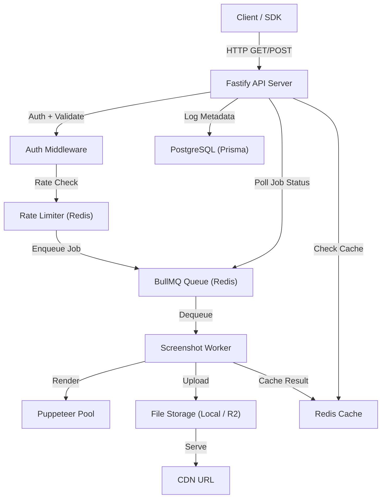

# Screenshot API Service — Implementation Plan

A production-ready Screenshot-as-a-Service platform enabling developers to generate website screenshots via a simple API, comparable to ScreenshotOne, Urlbox, and Microlink.

---

## High-Level Architecture



---

## Tech Stack Summary

| Layer | Technology | Rationale |
|---|---|---|
| **Runtime** | Node.js 20+ / TypeScript 5 | Best Puppeteer ecosystem, async-first |
| **Framework** | Fastify 5 | Faster than Express, native TS, plugin system |
| **Browser** | Puppeteer + puppeteer-extra + stealth | Mature, easy MVP, stealth for anti-bot |
| **Queue** | BullMQ 5 + ioredis | Retry, concurrency, priority, battle-tested |
| **Database** | PostgreSQL 16 + Prisma 6 | Users, API keys, jobs, billing metadata |
| **Cache** | Redis 7 (via ioredis) | Screenshot result caching by content hash |
| **Storage** | Local FS (MVP) → Cloudflare R2 (prod) | S3-compatible, zero egress fees |
| **Monorepo** | Turborepo + pnpm workspaces | Incremental builds, shared packages |
| **Dashboard** | Next.js 15 + Tailwind + shadcn/ui | Phase 7 only |

---

## Monorepo Structure

```
screenshot-api/                         ← repo root
├── turbo.json
├── pnpm-workspace.yaml
├── package.json
├── .env.example
├── docker-compose.yml                  ← PostgreSQL + Redis for local dev
│
├── apps/
│   ├── api/                            ← Fastify API server
│   │   ├── package.json
│   │   ├── tsconfig.json
│   │   └── src/
│   │       ├── index.ts                ← server entry
│   │       ├── app.ts                  ← Fastify app factory
│   │       ├── routes/
│   │       │   ├── screenshot.ts       ← GET/POST /api/screenshot
│   │       │   ├── health.ts           ← GET /api/health
│   │       │   └── keys.ts            ← CRUD /api/keys
│   │       ├── plugins/
│   │       │   ├── auth.ts             ← API key auth plugin
│   │       │   ├── rate-limit.ts       ← rate limiting plugin
│   │       │   └── redis.ts            ← Redis connection plugin
│   │       ├── middleware/
│   │       │   └── error-handler.ts
│   │       └── config/
│   │           └── env.ts              ← typed env with zod
│   │
│   ├── worker/                         ← Screenshot worker process
│   │   ├── package.json
│   │   ├── tsconfig.json
│   │   └── src/
│   │       ├── index.ts                ← worker entry
│   │       ├── processor.ts            ← BullMQ job processor
│   │       ├── browser/
│   │       │   ├── pool.ts             ← Browser pool (generic-pool)
│   │       │   ├── screenshot.ts       ← Core screenshot logic
│   │       │   └── devices.ts          ← Viewport presets
│   │       ├── storage/
│   │       │   ├── local.ts            ← Local FS adapter
│   │       │   ├── r2.ts               ← Cloudflare R2 adapter
│   │       │   └── interface.ts        ← Storage interface
│   │       └── config/
│   │           └── env.ts
│   │
│   └── dashboard/                      ← Phase 7: Next.js dashboard
│       └── ...
│
├── packages/
│   ├── shared/                         ← Shared types, constants, utils
│   │   ├── package.json
│   │   ├── tsconfig.json
│   │   └── src/
│   │       ├── types.ts                ← ScreenshotOptions, JobResult, etc.
│   │       ├── constants.ts            ← defaults, limits
│   │       ├── hash.ts                 ← cache key generation
│   │       ├── url-validator.ts        ← SSRF prevention
│   │       └── index.ts
│   │
│   ├── db/                             ← Prisma client + schema
│   │   ├── package.json
│   │   ├── tsconfig.json
│   │   ├── prisma/
│   │   │   ├── schema.prisma
│   │   │   └── migrations/
│   │   └── src/
│   │       └── index.ts                ← re-export PrismaClient
│   │
│   ├── queue/                          ← BullMQ queue definitions
│   │   ├── package.json
│   │   ├── tsconfig.json
│   │   └── src/
│   │       ├── queues.ts               ← queue instances
│   │       ├── jobs.ts                 ← job types
│   │       └── index.ts
│   │
│   ├── sdk/                            ← Phase 6: public npm SDK
│   │   └── ...
│   │
│   └── tsconfig/                       ← shared TS configs
│       ├── base.json
│       ├── node.json
│       └── nextjs.json
│
└── scripts/
    └── seed.ts                         ← dev seed script
```

---

## Phase 1 — Basic MVP (Core Screenshot Endpoint)

**Goal:** `GET /api/screenshot?url=https://example.com` returns a PNG image.

### 1.1 — Project Scaffolding

#### Root Setup
- Initialize pnpm workspace with `pnpm-workspace.yaml`
- Create root `package.json` with turbo scripts
- Create `turbo.json` with `build`, `dev`, `lint` pipelines
- Create `docker-compose.yml` for PostgreSQL 16 + Redis 7

#### Shared TypeScript Config (`packages/tsconfig/`)
- `base.json`: strict mode, ES2022 target, NodeNext module resolution
- `node.json`: extends base, for Node.js apps

#### Shared Package (`packages/shared/`)
- `ScreenshotOptions` type: `url`, `width`, `height`, `fullPage`, `format`, `quality`, `delay`, `selector`, `darkMode`, `deviceName`
- `JobResult` type: `id`, `status`, `imageUrl`, `cachedAt`, `renderTimeMs`
- Default constants: `DEFAULT_WIDTH=1440`, `DEFAULT_HEIGHT=900`, `DEFAULT_FORMAT='png'`, `MAX_TIMEOUT=30000`
- URL validator with SSRF protection (details in Phase security section)
- Cache hash generator: `sha256(url + width + height + format + quality + options)`

### 1.2 — API Server (`apps/api/`)

#### Dependencies
```
fastify @fastify/cors @fastify/sensible
zod                                     ← request validation
ioredis                                 ← Redis client
bullmq                                  ← queue producer
@screenshot-api/shared                  ← workspace:*
@screenshot-api/queue                   ← workspace:*
```

#### `src/app.ts` — Fastify App Factory
- Register CORS, sensible, error handler
- Register Redis plugin (ioredis singleton)
- Register screenshot routes
- Register health route

#### `src/routes/screenshot.ts`
- **`GET /api/screenshot`** — Synchronous mode (MVP)
  1. Parse + validate query params with Zod schema
  2. Validate URL (SSRF check via `packages/shared`)
  3. Generate cache hash key
  4. Check Redis cache → if hit, redirect to cached URL or stream cached buffer
  5. If miss → enqueue BullMQ job, **wait** for completion (up to 30s timeout using `Job.waitUntilFinished()`)
  6. Return `image/png` buffer directly

#### `src/config/env.ts`
- Zod-validated env: `PORT`, `REDIS_URL`, `DATABASE_URL`, `NODE_ENV`, `STORAGE_PATH`

### 1.3 — Worker (`apps/worker/`)

#### Dependencies
```
puppeteer puppeteer-extra puppeteer-extra-plugin-stealth
bullmq ioredis
generic-pool                            ← browser pooling
@screenshot-api/shared                  ← workspace:*
@screenshot-api/queue                   ← workspace:*
```

#### `src/browser/pool.ts` — Browser Pool
```typescript
// Using generic-pool
const factory = {
  create: async () => {
    const browser = await puppeteer.launch({
      headless: true,
      args: ['--no-sandbox', '--disable-dev-shm-usage',
             '--disable-gpu', '--disable-extensions',
             '--disable-background-networking']
    });
    return browser;
  },
  destroy: async (browser) => await browser.close(),
  validate: async (browser) => {
    try { await browser.version(); return true; }
    catch { return false; }
  }
};

const pool = createPool(factory, {
  max: 3,             // max concurrent browsers
  min: 1,             // keep 1 warm
  idleTimeoutMillis: 60000,
  testOnBorrow: true  // validate before use
});
```

#### `src/browser/screenshot.ts` — Core Screenshot Logic
1. Acquire browser from pool
2. Create new page via `browser.newPage()`
3. Set viewport (`width`, `height`)
4. Apply stealth plugin settings
5. Navigate: `page.goto(url, { waitUntil: 'networkidle2', timeout: 30000 })`
6. Optional: wait for selector, inject dark mode CSS, apply delay
7. Take screenshot: `page.screenshot({ fullPage, type: format, quality })`
8. Close page (not browser)
9. Release browser back to pool
10. Return buffer

#### `src/processor.ts` — BullMQ Job Processor
1. Receive job from queue
2. Call screenshot service
3. Save buffer to storage (local FS for MVP)
4. Cache result URL in Redis (TTL: 1 hour)
5. Return result

#### `src/storage/interface.ts`
```typescript
export interface StorageAdapter {
  upload(key: string, buffer: Buffer, contentType: string): Promise<string>;
  getUrl(key: string): string;
  delete(key: string): Promise<void>;
}
```
- `local.ts`: saves to `./screenshots/YYYY/MM/DD/<hash>.png`, serves via static file route
- `r2.ts`: placeholder for Phase 3

### 1.4 — Queue Package (`packages/queue/`)
```typescript
// queues.ts
export const SCREENSHOT_QUEUE = 'screenshots';

export function createScreenshotQueue(connection: IORedis) {
  return new Queue(SCREENSHOT_QUEUE, { connection });
}

// jobs.ts
export interface ScreenshotJobData {
  url: string;
  width: number;
  height: number;
  fullPage: boolean;
  format: 'png' | 'jpeg' | 'webp';
  quality?: number;
  delay?: number;
  selector?: string;
  darkMode?: boolean;
  deviceName?: string;
  cacheKey: string;
}
```

---

## Phase 2 — Queue Architecture & Async Mode

**Goal:** Decouple API from rendering; support both sync and async modes.

### 2.1 — Async Endpoint

#### `POST /api/screenshot` (async mode)
```
POST /api/screenshot
{ "url": "https://example.com", "width": 1440, "async": true }
```
**Response (202 Accepted):**
```json
{ "jobId": "abc-123", "status": "queued", "statusUrl": "/api/screenshot/abc-123" }
```

#### `GET /api/screenshot/:jobId` (status polling)
```json
{
  "jobId": "abc-123",
  "status": "completed",
  "imageUrl": "https://cdn.example.com/screenshots/abc123.png",
  "renderTimeMs": 2340
}
```

### 2.2 — Webhook Support
- Optional `webhookUrl` param on POST
- Worker sends POST to webhook URL on job completion with result payload
- Validate webhook URL (same SSRF rules)

### 2.3 — Worker Concurrency & Resilience
- BullMQ worker concurrency: `5` (configurable via env)
- Job timeout: `60s`
- Max retries: `3` with exponential backoff (`2^attempt * 1000ms`)
- Stalled job detection: `30s` check interval
- Max browser uses: restart browser after `50` pages (memory leak prevention)
- Graceful shutdown: drain queue on `SIGTERM`

### 2.4 — Bull Board (Admin UI)
- Mount `@bull-board/fastify` at `/admin/queues`
- Protected by admin auth (basic auth or env-based secret)
- Shows job states, failures, throughput, queue depth

---

## Phase 3 — File Storage (Cloudflare R2)

**Goal:** Persistent, CDN-backed storage for screenshots.

### 3.1 — R2 Storage Adapter (`apps/worker/src/storage/r2.ts`)
```typescript
import { S3Client, PutObjectCommand } from '@aws-sdk/client-s3';

export class R2StorageAdapter implements StorageAdapter {
  private client: S3Client;

  constructor(config: R2Config) {
    this.client = new S3Client({
      region: 'auto',
      endpoint: config.endpoint,
      credentials: {
        accessKeyId: config.accessKeyId,
        secretAccessKey: config.secretAccessKey,
      },
    });
  }

  async upload(key: string, buffer: Buffer, contentType: string): Promise<string> {
    await this.client.send(new PutObjectCommand({
      Bucket: this.config.bucket,
      Key: `screenshots/${key}`,
      Body: buffer,
      ContentType: contentType,
      CacheControl: 'public, max-age=86400',
    }));
    return `${this.config.publicUrl}/screenshots/${key}`;
  }
}
```

### 3.2 — Storage Strategy Pattern
- `STORAGE_PROVIDER` env var: `'local' | 'r2' | 's3'`
- Factory function selects adapter at startup
- All adapters implement `StorageAdapter` interface

### 3.3 — File Organization
```
screenshots/
  └── 2026/05/08/
      ├── a1b2c3d4.png
      └── e5f6g7h8.jpeg
```

### 3.4 — Response Format
```json
{
  "success": true,
  "data": {
    "imageUrl": "https://pub-xxx.r2.dev/screenshots/2026/05/08/a1b2c3d4.png",
    "format": "png",
    "width": 1440,
    "height": 900,
    "renderTimeMs": 1850,
    "cached": false,
    "expiresAt": "2026-05-09T21:00:00Z"
  }
}
```

---

## Phase 4 — Database & Authentication

**Goal:** API key auth, user accounts, usage tracking.

### 4.1 — Database Schema (`packages/db/prisma/schema.prisma`)

```prisma
generator client {
  provider = "prisma-client-js"
}

datasource db {
  provider = "postgresql"
  url      = env("DATABASE_URL")
}

model User {
  id        String   @id @default(cuid())
  email     String   @unique
  name      String?
  plan      Plan     @default(FREE)
  createdAt DateTime @default(now())
  updatedAt DateTime @updatedAt
  apiKeys   ApiKey[]
  jobs      ScreenshotJob[]
}

model ApiKey {
  id          String    @id @default(cuid())
  name        String    @default("Default")
  prefix      String                      // "sk_live_" visible prefix
  hashedKey   String    @unique            // SHA-256 hash
  userId      String
  user        User      @relation(fields: [userId], references: [id], onDelete: Cascade)
  lastUsedAt  DateTime?
  expiresAt   DateTime?
  revoked     Boolean   @default(false)
  createdAt   DateTime  @default(now())

  @@index([hashedKey])
}

model ScreenshotJob {
  id            String    @id @default(cuid())
  userId        String
  user          User      @relation(fields: [userId], references: [id])
  url           String
  options       Json                       // full options snapshot
  status        JobStatus @default(QUEUED)
  imageUrl      String?
  renderTimeMs  Int?
  errorMessage  String?
  cacheHit      Boolean   @default(false)
  createdAt     DateTime  @default(now())
  completedAt   DateTime?

  @@index([userId, createdAt])
  @@index([status])
}

enum Plan {
  FREE
  PRO
  ENTERPRISE
}

enum JobStatus {
  QUEUED
  PROCESSING
  COMPLETED
  FAILED
}
```

### 4.2 — Auth Middleware (`apps/api/src/plugins/auth.ts`)
1. Extract `Authorization: Bearer sk_live_xxxxx` header
2. Hash the provided key with SHA-256
3. Query `ApiKey` table by `hashedKey`
4. Check `revoked === false` and `expiresAt` not passed
5. Attach `user` and `apiKey` to Fastify request decorator
6. Update `lastUsedAt` (debounced, not on every request)

### 4.3 — API Key Management Routes (`apps/api/src/routes/keys.ts`)
- `POST /api/keys` — create new API key (returns raw key **once**)
- `GET /api/keys` — list user's keys (prefix only, never raw key)
- `DELETE /api/keys/:id` — revoke key
- Protected by session auth (for dashboard) or a master key (for bootstrapping)

### 4.4 — Usage Logging
- After each job completes, worker creates `ScreenshotJob` record via Prisma
- API can query `ScreenshotJob` for user's history

---

## Phase 5 — Rate Limiting

**Goal:** Prevent abuse, enforce plan-based quotas.

### 5.1 — Request Rate Limiting
- Use `@fastify/rate-limit` plugin
- Backed by Redis (ioredis)
- Keyed by API key (not IP)
- Limits per plan:

| Plan | Requests/min | Requests/day |
|---|---|---|
| FREE | 10 | 100 |
| PRO | 60 | 10,000 |
| ENTERPRISE | 200 | 100,000 |

### 5.2 — Response Headers
```
X-RateLimit-Limit: 100
X-RateLimit-Remaining: 87
X-RateLimit-Reset: 1715212800
```

### 5.3 — Daily Quota Tracking
- Redis sorted set per user per day: `quota:{userId}:{YYYY-MM-DD}`
- Increment on each successful request
- TTL: 48 hours (auto-cleanup)
- Check quota before enqueuing job

---

## Phase 6 — SDK (`packages/sdk/`)

**Goal:** Publishable npm package `@screenshot-api/sdk`.

### 6.1 — SDK Structure
```
packages/sdk/
├── package.json         ← name: @screenshot-api/sdk
├── tsconfig.json
├── tsup.config.ts       ← bundles CJS + ESM
├── README.md
└── src/
    ├── index.ts
    ├── client.ts        ← ScreenshotAPI class
    ├── types.ts         ← exported types
    ├── errors.ts        ← typed error classes
    └── utils.ts         ← retry logic, URL builder
```

### 6.2 — SDK API Design
```typescript
import { ScreenshotAPI } from '@screenshot-api/sdk';

const client = new ScreenshotAPI({
  apiKey: process.env.SCREENSHOT_API_KEY!,
  baseUrl: 'https://api.yourscreenshot.com', // optional
  timeout: 30000,                            // optional
  retries: 3,                                // optional
});

// Synchronous — returns image URL
const result = await client.screenshot({
  url: 'https://example.com',
  width: 1440,
  height: 900,
  fullPage: true,
  format: 'png',
  darkMode: false,
});
console.log(result.imageUrl);

// Async mode — returns job ID, poll for result
const job = await client.screenshotAsync({ url: 'https://example.com' });
const completed = await client.waitForJob(job.jobId, { pollInterval: 1000 });
console.log(completed.imageUrl);

// Download buffer directly
const buffer = await client.downloadScreenshot(result.imageUrl);
```

### 6.3 — SDK Features
- Full TypeScript types exported
- Automatic retries with exponential backoff
- Configurable timeout
- `screenshotAsync()` + `waitForJob()` for async workflows
- `downloadScreenshot()` helper for streaming buffer
- Custom error classes: `AuthError`, `RateLimitError`, `TimeoutError`, `ValidationError`
- Bundle with `tsup`: ESM + CJS dual output

---

## Phase 7 — Dashboard (Next.js)

**Goal:** Web UI for API key management, usage monitoring, and screenshot history.

> [!NOTE]
> This phase is optional for MVP but powerful for a SaaS product. It will be built **after** the core API is stable and fully tested.

### 7.1 — Dashboard Features
- **Auth:** Email/password login (or OAuth via NextAuth)
- **API Keys:** Create, view, revoke keys
- **Usage Stats:** Charts showing daily/monthly usage, quota remaining
- **Screenshot History:** Paginated list with thumbnails, status, render time
- **Settings:** Plan info, account settings

### 7.2 — Tech Stack
- Next.js 15 (App Router)
- Tailwind CSS v4 + shadcn/ui
- Recharts for usage charts
- Communicates with API server via internal routes or direct DB access

---

## Security — SSRF Prevention (All Phases)

> [!CAUTION]
> SSRF is the **#1 security risk** in a screenshot service. Users could abuse the headless browser to access internal services, cloud metadata endpoints, or private networks.

### Implementation (`packages/shared/src/url-validator.ts`)

```typescript
export function validateUrl(input: string): { valid: boolean; reason?: string } {
  // 1. Parse with URL constructor
  let parsed: URL;
  try { parsed = new URL(input); }
  catch { return { valid: false, reason: 'Invalid URL format' }; }

  // 2. Protocol whitelist
  if (!['http:', 'https:'].includes(parsed.protocol)) {
    return { valid: false, reason: 'Only http/https allowed' };
  }

  // 3. Hostname blocklist
  const blocked = ['localhost', '127.0.0.1', '0.0.0.0', '[::1]', 'metadata.google.internal'];
  if (blocked.includes(parsed.hostname)) {
    return { valid: false, reason: 'Blocked hostname' };
  }

  // 4. Private IP ranges (after DNS resolution in worker)
  // 10.0.0.0/8, 172.16.0.0/12, 192.168.0.0/16, 169.254.169.254
  // Resolved and checked at render time, not just at parse time

  return { valid: true };
}
```

### Additional Measures
- DNS resolution check before navigation (prevent DNS rebinding)
- Disable redirects or re-validate after redirect
- Run browser in sandboxed container with limited network egress
- Block `file://`, `ftp://`, `gopher://` protocols
- Block cloud metadata IPs (`169.254.169.254`)

---

## User Review Required

> [!IMPORTANT]
> **Storage Provider:** The plan defaults to local filesystem for MVP and Cloudflare R2 for production. Do you want to use a different provider (AWS S3, Backblaze B2)?

> [!IMPORTANT]
> **Database Hosting:** The plan uses local PostgreSQL via Docker for development. Do you have a preferred production database host (Railway, Supabase, Neon)?

> [!IMPORTANT]
> **Dashboard Priority:** Phase 7 (Dashboard) is marked optional. Should it be included in the initial build, or deferred to a follow-up?

## Open Questions

1. **Project Name:** What should the project/package be named? (e.g., `snapforge`, `screenapi`, `capturekit`). This affects npm scope, repo name, and branding.
2. **Authentication Bootstrapping:** For MVP, should we include a simple user registration endpoint, or only support pre-seeded API keys via a CLI/seed script?
3. **Deployment Target:** Are you planning to deploy to Railway, Fly.io, Render, or self-host via Docker? This affects Dockerfile and CI setup.
4. **Redis Hosting:** Use Docker Redis for dev — but for production, Upstash (serverless) or Railway Redis (managed)?

---

## Verification Plan

### Automated Tests
- **Unit tests** (Vitest): URL validator, cache hash, storage adapters, SDK client
- **Integration tests**: API endpoint → queue → worker → storage round-trip
- **Command:** `pnpm turbo run test` across all packages

### Manual Verification (per phase)
| Phase | Verification |
|---|---|
| 1 | `curl "http://localhost:3000/api/screenshot?url=https://example.com" --output test.png` → valid PNG |
| 2 | POST async job → poll status → get completed URL |
| 3 | Screenshot uploaded to R2 → accessible via CDN URL |
| 4 | Request without API key → 401; with valid key → 200 |
| 5 | Exceed rate limit → 429 with proper headers |
| 6 | `npm install @screenshot-api/sdk` → `client.screenshot()` works |
| 7 | Dashboard login → create key → view usage chart |

### Browser Testing
- Use browser subagent to test dashboard UI flows (Phase 7)
- Verify screenshot quality by opening output PNGs

---

## Execution Order

```mermaid
gantt
    title Implementation Phases
    dateFormat X
    axisFormat %s

    section Foundation
    Phase 1 - MVP              :p1, 0, 3
    section Scale
    Phase 2 - Queue Arch       :p2, after p1, 2
    Phase 3 - File Storage     :p3, after p2, 1
    section Auth
    Phase 4 - Database & Auth  :p4, after p3, 2
    Phase 5 - Rate Limiting    :p5, after p4, 1
    section Developer UX
    Phase 6 - SDK              :p6, after p5, 1
    section UI
    Phase 7 - Dashboard        :p7, after p6, 3
```



Each phase builds on the previous and is independently testable.
